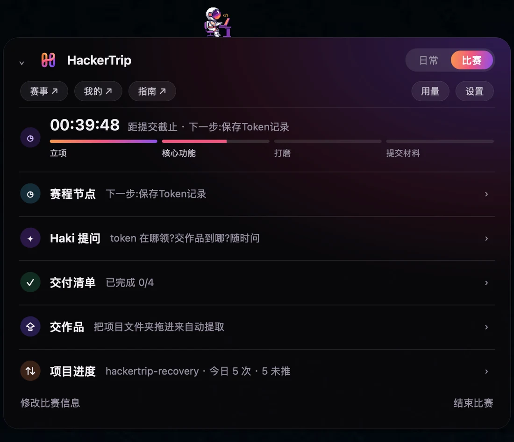
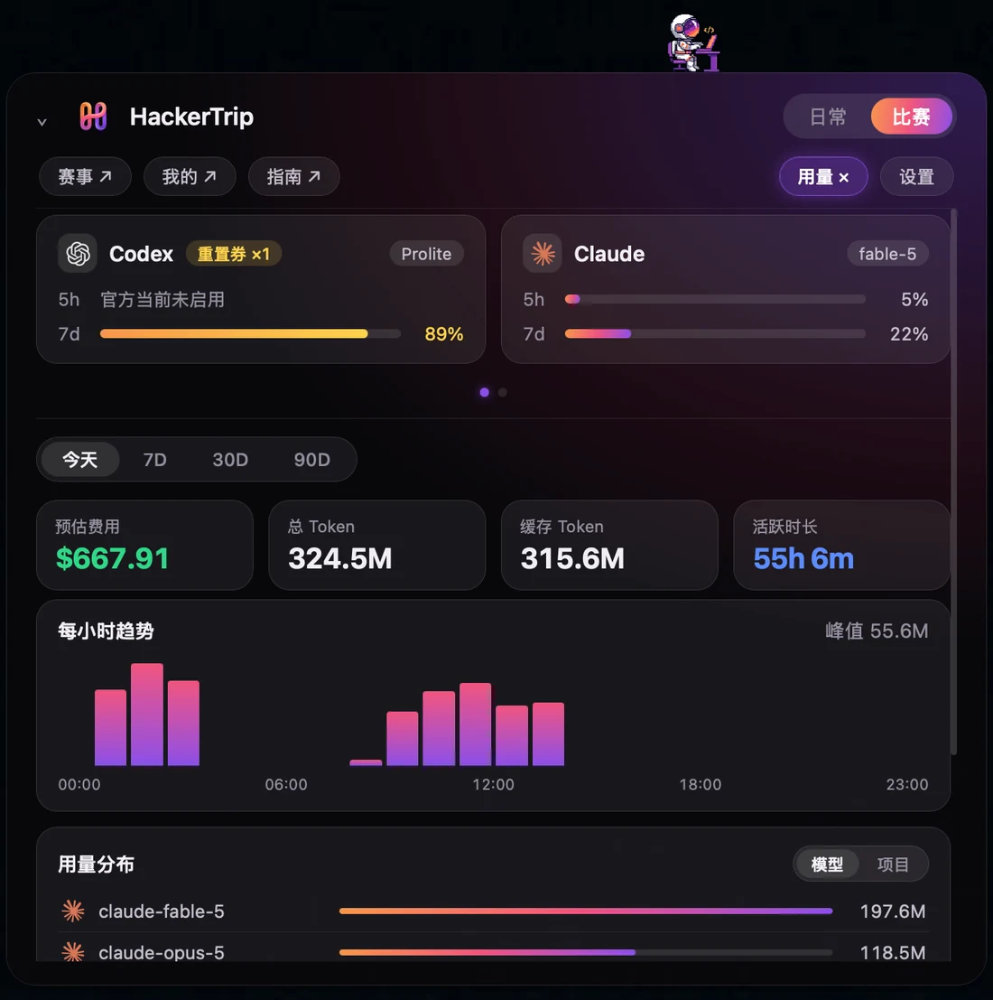

<div align="center">


# Haki Desktop

**黑客松现场的桌面搭子 —— agent 干活他推箱子，该你上场他提醒你。**

用真实过程数据（token 用量 · commit 记录 · 作品交付），证明你的 AI 协作能力。

[](https://tauri.app)
[](#快速开始)
[](https://hackertrip.space/haki-desktop)

[官网介绍页](https://hackertrip.space/haki-desktop) · [HackerTrip 主站](https://hackertrip.space) · [快速开始](#快速开始)

</div>

---

## 他是谁

Haki 是住在**置顶悬浮条**上的像素小人。你不用点开任何面板——他的动作就是你所有 coding agent 的状态：

|  |  |  |  |
|:---:|:---:|:---:|:---:|
| **来回推箱子** | **掏出 Switch** | **桌前敲代码** | **就地睡觉** |
| 日常模式 · agent 干活中 | 日常模式 · 等你确认 | 比赛模式 · 冲刺中 | 比赛模式 · 空闲 |

比赛模式下，Haki 的**水平位置 = 交作品倒计时进度**——他走到哪，比赛就进行到哪。

## 功能一览

| 比赛作战面板 | Token 用量 |
|:---:|:---:|
|  |  |
| 倒计时四阶段 · 赛程节点提醒 · 交付清单 · 拖文件夹交作品 | 额度双卡滑动轮播 · 每小时趋势 · 模型/项目分布 |
| **Haki 赛事问答** | **项目进度** |
|  |  |
| 贴入主办方文档随时提问，CLI 大模型 / 本地检索双路由 | commit 与 push 实时入档，过程数据就是参赛履历 |

- **多 agent 实时监控**：自动发现本机 `claude` / `codex` / `gemini` / `aider` 等进程，session 条给出任务概述、目录、分支、改动量；等确认时状态点变色提醒
- **多来源用量计量**：Claude / Codex / Grok / Gemini 合并计量，预估费用、缓存、活跃时长、19 家模型公司官方 logo 分布
- **比赛模式**：比赛名 + 截止时间即可开赛，AI 自动拆赛程节点，临近提醒；材料清单从文档自动推断
- **项目进度**：绑定参赛仓库，超 45 分钟未 commit 黄色提醒，逐条明细带「已推送 / 未推送」徽标

## 快速开始

```bash
git clone https://github.com/Jayden72Huang/haki-desktop.git
cd haki-desktop/app
npm install
npm run tauri dev
```

依赖：Node 18+ · Rust（stable）· macOS（透明置顶窗口依赖 `macOSPrivateApi`）。

## 技术栈

- **Tauri 2** — 660px 无边框透明置顶悬浮窗
- **原生 TypeScript**（无框架）+ 手绘像素 sprite（动画位移曲线移植自 [lil-agents](https://github.com/ryanstephen/lil-agents) 的梯形速度模型）
- **Rust** — agent 进程扫描（`ps`/`lsof`/`git`）、会话日志解析、24 小时分时用量分桶，全部本地执行

## 隐私

所有数据在本机读取与计算（`~/.claude` / `~/.codex` 等会话日志、git 记录）。可选的云端同步只上报**统计特征与仓库名**，源码、对话内容、本地路径不出本机。

## 相关

- 产品介绍页：[hackertrip.space/haki-desktop](https://hackertrip.space/haki-desktop)
- HackerTrip 一站式黑客松平台：[hackertrip.space](https://hackertrip.space)
- 早期产品规划：[docs/PLAN.md](docs/PLAN.md)

---

<div align="center"><sub>Haki by <a href="https://hackertrip.space">HackerTrip</a> · 用真实过程数据，证明你的 AI 协作能力</sub></div>
